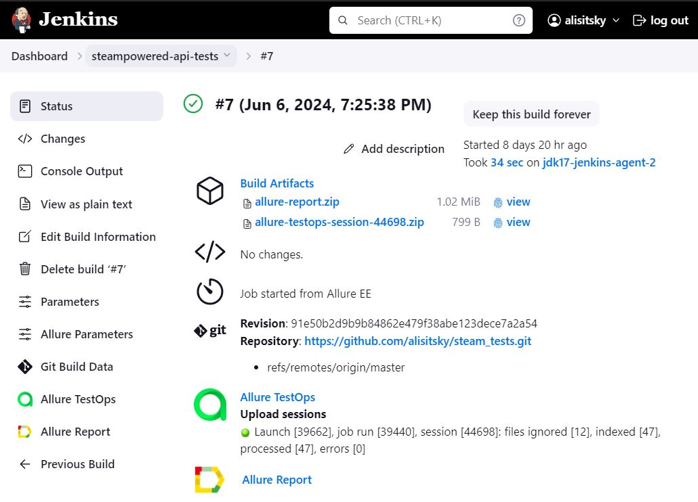
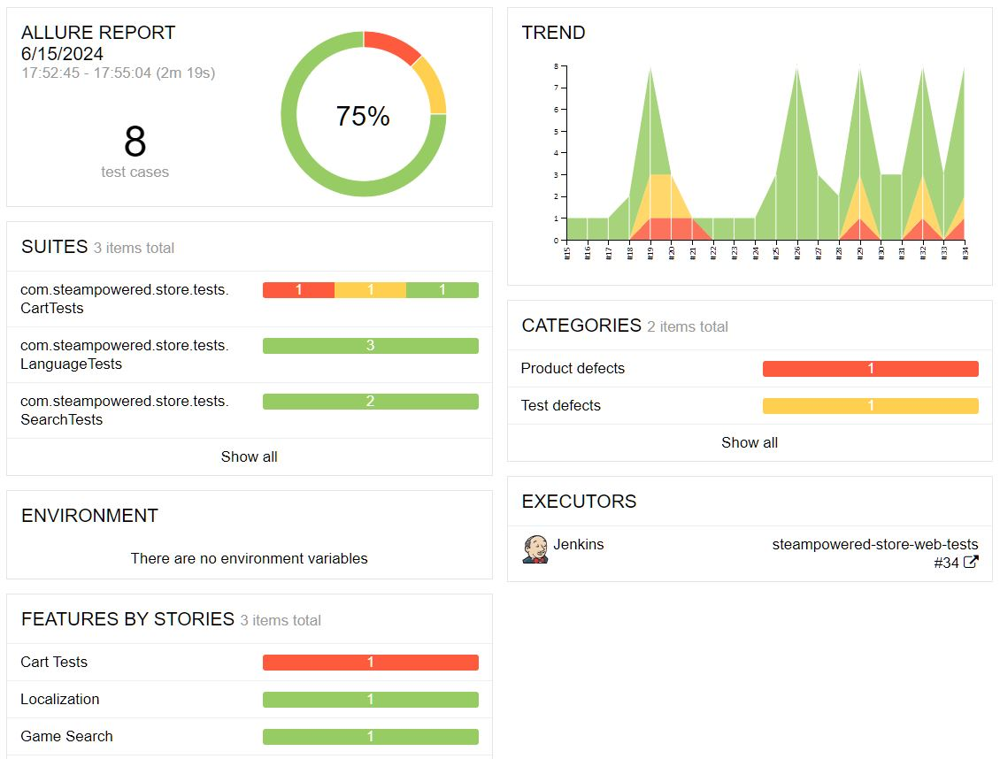
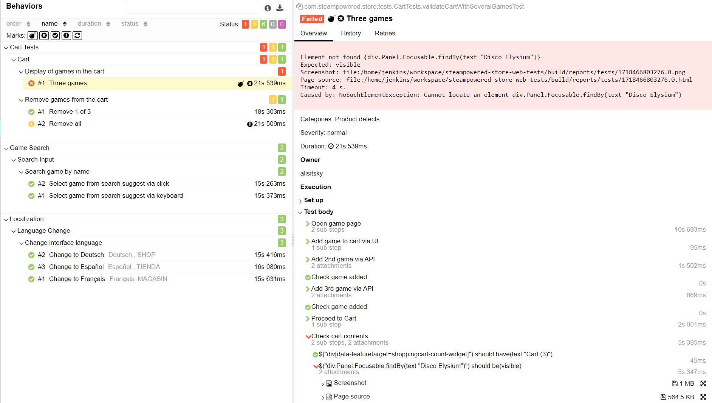
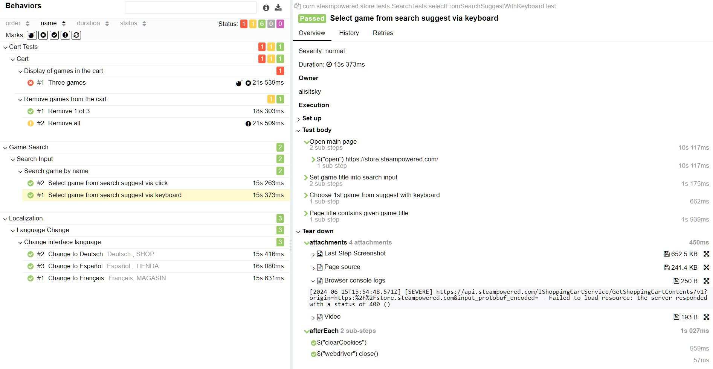

<div style="display: flex; justify-content: space-between; align-items: center;">
  <div>
Project of test automation for <b>steampowered</b> products:<br>
    - <a href="https://store.steampowered.com"><b>store</b>.steampowered.com</a><br>
    - <a href="https://api.steampowered.com"><b>api</b>.steampowered.com</a><br>
  </div>
  <div>
    <a href="https://store.steampowered.com">
      
    </a>
  </div>
</div>

____
## Content:

- <a href="#tools">Tech stack and tools</a>
- <a href="#cases">Automated Test Cases</a>
- <a href="#runtests">Local Tests Execution</a>
- <a href="#jenkins">Jenkins Build</a>
- <a href="#allureReport">Allure Report Example</a>
- <a href="#allure">Allure TestOps Integration</a>
- <a href="#jira">Jira Integration</a>
- <a href="#telegram">Slack / TG Notifications</a>
- <a href="#video">Test execution video</a>

____
<a id="tools"></a>
## Tech stack and tools

<p>


**Code:**
    <a href="https://www.java.com/">
          
        </a> 
    <a href="https://gradle.org/">
          
        </a>
<a href="https://selenide.org/">
          
        </a>
        <a href="https://junit.org/junit5/">
          
        </a>
        <a href="https://rest-assured.io/">
          
        </a>

**Infrastructure:**
<a href="https://www.jenkins.io/">

        </a>
<a href="https://aerokube.com/selenoid/">
          
        </a>
<a href="https://qameta.io/">
          
        </a>
<a href="https://www.atlassian.com/ru/software/jira/">

</a>

**Visualization:**
<a href="https://github.com/allure-framework/allure2">
          
        </a>
        <a href="https://slack.com/">
          
        </a>
        <a href="https://telegram.org/">
          
        </a>
<br><br>
Web tests are written in [**Java**](https://www.java.com/), using [**Selenide**](https://selenide.org/) framework. For API tests [**REST-assured**](https://rest-assured.io/) is used. The build tool here is [**Gradle**](https://gradle.org/).  
As soon as [**Jenkins**](https://www.jenkins.io/) build is started tests are being remotly executed in [**Selenoid**](https://aerokube.com/selenoid/).  
Then  [**Allure Report**](https://allurereport.org/) is generated (containing steps, screens, videos, logs), and notifications are sent to Slack and Telegram.  
[**Allure TestOps**](https://qameta.io/) and [**Jira**](https://www.atlassian.com/software/jira) has also been integrated for test management and issue tracking purposes.
____
<a id="cases"></a>
##  Automated Test Cases
**WEB**:
- Cart
  - Display of games in the cart
  - Remove 1 of 3 games
  - Remove all games
- Language
  - Change interface language [parametrized]
- Search by game title
    - Select game from search suggest via click
    - Select game from search suggest via keyboard


**API**:
- News Endpoint Tests
  - Json schema validation
  - Response content-type is changed by cgi [parametrized]
  - News count is changed by cgi [parametrized]
  - All the news have given tag

____
<a id="runtests"></a>
## Local execution

<em> Run <b>WEB</b> tests: </em>

```
gradle clean webTest 
```
<em> Run <b>API</b> tests: </em>

```
gradle clean apiTest 
```

<em>Customize browser</b>:</em>
```
gradle clean webTest -Dbrowser=firefox -DbrowserSize=2550x1440
```


<em>Generate and open html-report</em>
```
gradle allureServe
```


____

<a id="jenkins"></a>
##  </a> Jenkins Build <a target="_blank"> </a>

Tests may also be executed, using [**Jenkins**](https://www.jenkins.io/) instance. To access a job for [**WEB**](https://jenkins.autotests.cloud/job/steampowered-store-web-tests/build/) or [**API**](https://jenkins.autotests.cloud/job/steampowered-api-tests/build) tests register here: https://jenkins.autotests.cloud/

To start the build, go to the "Build with parameters", choose params, and click "Build".

This way you will run chosen set of tests in a [**Selenoid**](https://aerokube.com/selenoid/) instance -- implementation of original Selenium hub, which is using Docker to launch browsers.

After the build is finished, click  or  to view HTML report and check this launch in TMS, respectively.


<p align="center">

</p>


____
<a id="allureReport"></a>
##  </a> <a target="_blank" href="https://allurereport.org/"> Allure Report </a> Example

Allure Report is an opensource tool for detailed customizable autotest reports, providing additional info (screenshots, videos, logs) to make debugging easier.

[**Report example link**](https://jenkins.autotests.cloud/job/steampowered-store-web-tests/34/allure/#)


<details>
  <summary><b>Screenshots:</b></summary>

<p align="center">

</p>

<p align="center">

</p>

<p align="center">

</p>


</details>

____
<a id="allure"></a>
##  </a> <a target="_blank" href="https://qameta.io/"> Allure TestOps </a> Integration

**Allure TestOps** is a powerful TMS for manual and automation testing. In this project some of its features have been implemented:

- Integration with CI/CD (Jenkins)
- Execution of any set of autotests directly from TMS
- Test-cases auto-update after every run
- Integration with JIRA
- Various analytics on test runs
 
 


<p align="center">

</p>

<p align="center">

</p>

____

<a id="jira"></a>
##  </a> Integration with <a target="_blank" href="https://jira.autotests.cloud/browse/HOMEWORK-1084"> Jira </a>

Integration of **Allure TestOps** and **Jira** is implemented. In the Jira task you can link test-cases or launches for the test-management purposes.

<p align="center">

</p>

____

<a id="telegram"></a>
##  Slack and  Telegram notifications


<p align="left">
  
  
</p>


____
<a id="video"></a>
##  </a> Video attachment example

The video of a test execution is attach to every testcase:

<p align="center">
  
</p>
